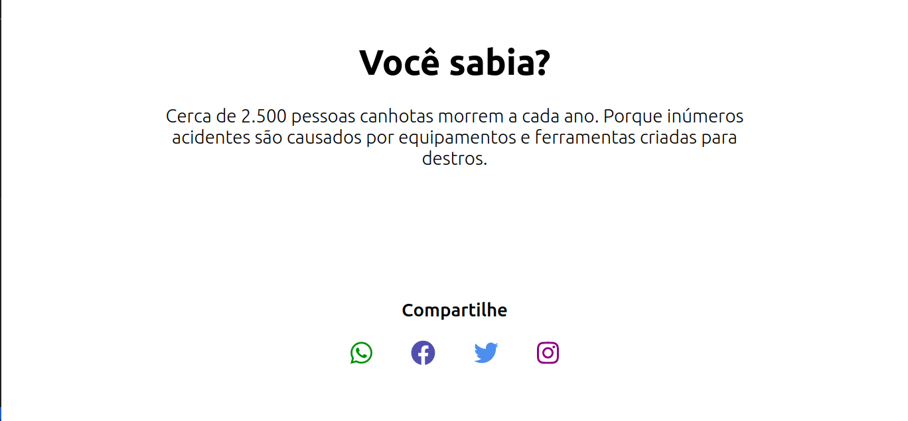

# Curiosidade Aleatória - React App

Projeto desenvolvido de forma autônoma para aprender mais sobre ReactJS. Consiste num site onde a cada momento que for aberto aparecerá uma curiosidade aleatória.


## Funcionalidade

O programa lê um arquivo JSON contendo diferentes curiosidades e exibe de forma aleatória uma dessas.



## Execução

Tanto no Windows quanto no Linux a execução é feita a partir da execução da linha a seguir no terminal. 

```bash
npm start
```
O projeto será aberto em http://localhost:3000

Além disso é possível abrir o projeto por meio do link direto abaixo:

https://antuniooh.github.io/curiosity-app/
